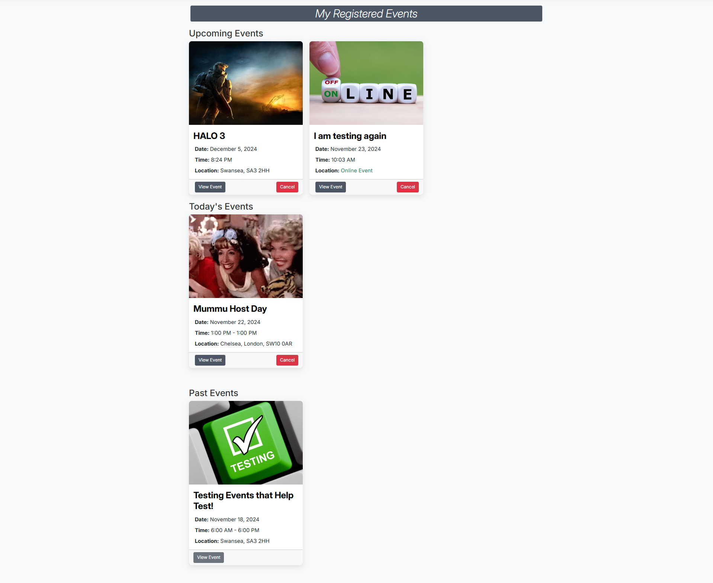
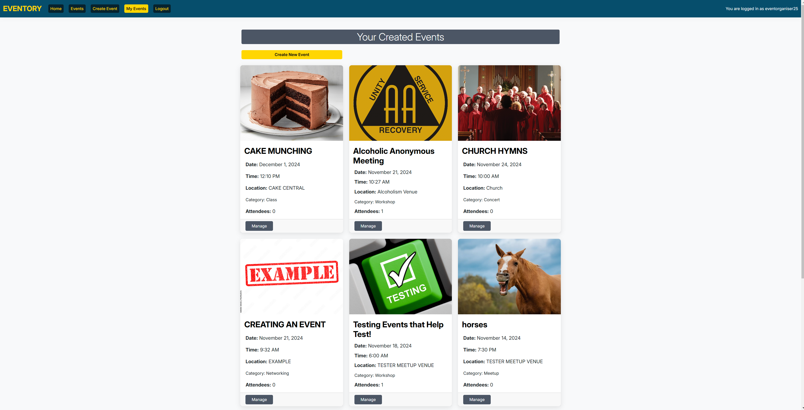

## EVENTORY

**BRAND IMAGE**

**"Connect People, Create Memories!"**

**REPSONSIVE SCREENSHOTS** 

------ 

### INTRODUCTION
**WHAT THE PROJECT IS** 

DESCRIPTION

**WHY IT EXISTS** 

PURPOSE 

**WHO IS IT FOR** 

TARGET AUDIENCE 

------
### WIREFRAMES 

#### LANDING PAGE

#### EVENT LIST

#### EVENT DETAIL

#### CREATE & EDIT EVENT 

#### EVENT USER REGISTERED EVENTS

#### ORGANISER CREATED EVENTS

#### ORGANISER EVENT DETAIL

#### ATTENDEE LIST FOR ORGANISERS 

#### SIGN UP PAGE

------
### CUSTOM MODEL ERD's 
------

------
### AGILE METHODOLOGY 
------

------
### FEATURES

The features will be presented and explained in relation to the epic stories as these are the core objectives that outlined the project planning and structure.

------
#### **Epic 1**: Event Browsing and Discovery
------

##### #1: View a list of upcoming events:

##### #2: View the details of a specific event:

##### #5: Filter specific events by category:

##### #7: See the event capacity:

------
#### Epic 2: Event Registration and Management for Attendees
------
##### #3: Register for an event.

##### #4: View a list of events I have registered for.

##### #6: Cancel my registration if I can no longer attend.

------
#### Epic 3: Event Creation and Management for Organisers
------
##### #8: Create a new event.

##### #9: View a list of all events I’ve created.

##### #10: Update the event details.

##### #11: Delete an event that is no longer happening.

##### #12: View a list of people who have registered for an event to contact.

------
#### Epic 4: Event Search and Analysis for Organisers
------
##### #14: filter events based on status, date, or category and organiser.

------
#### Epic 5: Platform Moderation for Admins
------
#####  #15: View a list of all events on the platform.

#####  #16: Filter through all events on the platform.

------

### TESTING

#### Validation
This validation was processed by using Heroku's URL into the URI validator with W3C.
Validation table for HTML templates:

| File Name           | Purpose                                                                 | W3C Validation Status              |
|---------------------|-------------------------------------------------------------------------|-------------------------------------|
| `Sign up`          | The sign-up page where users can register for an account.                | PASS                              |
| `Home`             | The homepage displaying an overview and key actions for the application. | PASS                             |
| `Event list`       | Lists all available events for users to browse and register.             | PASS                           |
| `Event detail`     | Displays detailed information about a specific event.                   | PASS                              |
| `Create event`     | Allows event organisers to create a new event.                          | PASS                             |
| `Edit`             | Enables event organisers to edit an existing event.                    | PASS                              |
| `Registered events`| Shows the list of events a user has registered for.                     | PASS                              |
| `Created events`   | Displays the list of events created by an organiser.                    | PASS                              |
| `Attendee list`    | Provides a list of attendees for a specific event (visible to organisers). | PASS                              |

#### Screenshots of Validation

**TEMPLATES** 

Sign Up

Home Page

Event List

Event Detail

Create Event

Edit Event

Registered Events

Created Events

Attendee List

Validation table for CSS, Javascript and Python:
| File Type   | File Name               | Purpose                                                                 | Validation Status                  |
|-------------|-------------------------|-------------------------------------------------------------------------|------------------------------------|
| CSS         | `style.css`            | Contains styles for the overall look and feel of the application.       | Valid (Checked with W3C CSS Validator) |
| JavaScript  | `script.js`            | Handles interactivity and event-driven functionality on the frontend.    | Valid (Linted with ESLint)         |
| Python      | `settings.py`          | Contains configuration settings for the Django project.                 | Valid (PEP8 Compliant)             |
| Python      | `views.py`             | Defines the logic and rendering for various web pages.                  | Valid (PEP8 Compliant)             |
| Python      | `models.py`            | Defines the data models for the application.                            | Valid (PEP8 Compliant)             |
| Python      | `forms.py`             | Contains form definitions for user input validation and handling.        | Valid (PEP8 Compliant)             |
| Python      | `urls.py`              | Maps URL paths to views for the Django application.                     | Valid (PEP8 Compliant)             |
| Python      | `admin.py`             | Registers models in the Django admin interface.                         | Valid (PEP8 Compliant)             |
| Python      | `signals.py`           | Contains signal handlers for event cancellations    | Valid (PEP8 Compliant)             |
| Python      | `context_processors.py`| Adds custom data for event user & organisers groups             | Valid (PEP8 Compliant)             |

#### Screenshots of Validation

**CSS**

**JAVASCRIPT**

**PYTHON**

Settings

Views

Models

Forms

Urls

Admin

Signals

Context Processors 

#### MANUAL TESTING 

#### AUTOMATED TESTING?
------
### DEPLOYMENT

------
### FUTURE FEATURES
------
#17 As an **event attendee** I would like to **write comments under the event detail** to **discuss with other attendees and leave positive reviews**

#18 As an **event organiser** I want to **write a bio on my page** so that **suitable organisers can connect with me**

------
### CREDITS
- Bootstrap layouts

