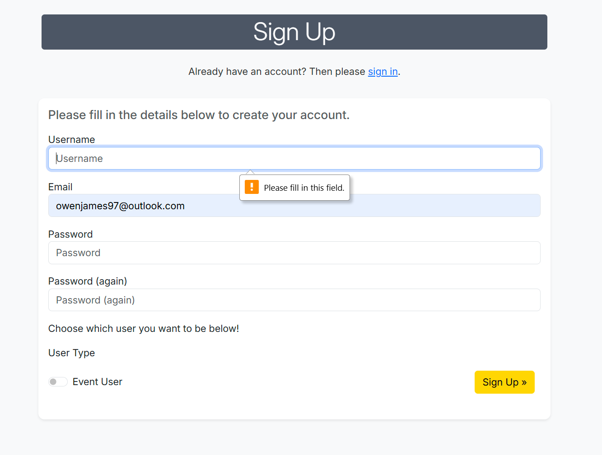

## EVENTORY

**BRAND IMAGE**

**"Connect People, Create Memories!"**

**REPSONSIVE SCREENSHOTS** 

------ 

### INTRODUCTION
**WHAT THE PROJECT IS** 

DESCRIPTION

**WHY IT EXISTS** 

PURPOSE 

**WHO IS IT FOR** 

TARGET AUDIENCE 
------
### Technologies
------
**Frontend**: HTML, CSS, Bootstrap, Javascript

**Backend**: Django, Python

**Database**: PostgreSQL

**Deployment**: Heroku

------
### WIREFRAMES 

#### LANDING PAGE

#### EVENT LIST

#### EVENT DETAIL

#### CREATE & EDIT EVENT 

#### EVENT USER REGISTERED EVENTS

#### ORGANISER CREATED EVENTS

#### ORGANISER EVENT DETAIL

#### ATTENDEE LIST FOR ORGANISERS 

#### SIGN UP PAGE

------
### CUSTOM MODELs
------

Below is the overview of all custom models used in this project including field name, field type, description, and relationships:

| **Model Name**   | **Field Name**      | **Description**                                                     | **Field Type**          | **Relationships**                                           |
|------------------|---------------------|---------------------------------------------------------------------|-------------------------|------------------------------------------------------------|
| **Location**     | venue_name          | Name of the venue                                                  | `CharField`             |                                                            |
| **Location**     | address_line_1      | Primary address of the location                                    | `CharField`             |                                                            |
| **Location**     | address_line_2      | Secondary address line (optional)                                  | `CharField`             |                                                            |
| **Location**     | town_city           | Town or city where the location is situated                        | `CharField`             |                                                            |
| **Location**     | county              | County or region of the location (optional)                         | `CharField`             |                                                            |
| **Location**     | postcode            | Postal code of the location                                        | `CharField`             |                                                            |
| **Location**     | is_online           | Boolean field to check if the event is online                       | `BooleanField`          |                                                            |
| **Event**        | title               | Title of the event                                                 | `CharField`             |                                                            |
| **Event**        | image_url           | URL to the event image                                             | `URLField`              |                                                            |
| **Event**        | start_date          | Date and time when the event starts                                | `DateTimeField`         |                                                            |
| **Event**        | end_date            | Date and time when the event ends                                  | `DateTimeField`         |                                                            |
| **Event**        | start_time          | Start time of the event                                            | `TimeField`             |                                                            |
| **Event**        | end_time            | End time of the event                                              | `TimeField`             |                                                            |
| **Event**        | location            | The location of the event                                          | `ForeignKey`            | ForeignKey to **Location** (A location can have many events) |
| **Event**        | organiser           | The user organizing the event                                      | `ForeignKey`            | ForeignKey to **User** (Each event has one organiser)      |
| **Event**        | description         | Description of the event                                           | `TextField`             |                                                            |
| **Event**        | capacity            | Maximum number of attendees                                        | `PositiveIntegerField`  |                                                            |
| **Event**        | category            | Category of the event (e.g., workshop, conference)                 | `CharField`             |                                                            |
| **Event**        | price               | Price of the event (optional)                                      | `DecimalField`          |                                                            |
| **Event**        | free                | Indicates whether the event is free                                | `BooleanField`          |                                                            |
| **Event**        | canceled            | Indicates if the event is canceled                                 | `BooleanField`          |                                                            |
| **Registration** | user                | The user who registered                                            | `ForeignKey`            | ForeignKey to **User** (A user can register for many events) |
| **Registration** | event               | The event the user registered for                                  | `ForeignKey`            | ForeignKey to **Event** (An event can have many registrations) |
| **Registration** | registered_at       | Timestamp when the user registered                                 | `DateTimeField`         |                                                            |
| **User**         | username            | The username of the user                                           | `CharField`             |                                                            |
| **User**         | email               | The email of the user                                              | `EmailField`            |                                                            |
| **User**         | password            | The password of the user                                           | `CharField`             |                                                            |

#### Relationships Summary:

Location has a one-to-many relationship with Event (One location can have many events).

Event has a many-to-one relationship with User (Each event is organized by one user).

Event has a many-to-one relationship with Location (Each event happens at one location).

Registration has a many-to-one relationship with both User and Event (Each registration is for one user and one event).

------
### AGILE METHODOLOGY 
------
This kanban based on the agile methodology approach is a visual representation of all the tasks, that comprised of main epic stories each with their own set of user stories. These were to be completed in order to finish the project successfully:

### Epic Stories and User Stories breakdown

### **Epic 1: Event Browsing and Discovery**
As an attendee, I want to easily browse, search, and discover events so that I can find the ones I’m most interested in and plan my participation.

| **Issue Number** | **User Story**                                                                 |
|------------------|---------------------------------------------------------------------------------|
| #1               | As an attendee, I want to view a list of upcoming events so that I can decide which event to attend. |
| #2               | As an attendee, I want to view the details of a specific event so that I can learn more about it. |
| #5               | As an attendee, I want to search for specific events by category or status so that I can speed up my search. |
| #7               | As an attendee, I want to see the event capacity and status so that I know if I can still register. |

### **Epic 2: Event Registration and Management for Attendees**
As an attendee, I want to manage my event registrations so that I can track my commitments and make changes as needed.

| **Issue Number** | **User Story**                                                                 |
|------------------|---------------------------------------------------------------------------------|
| #3               | As an attendee, I want to register for an event so that I can reserve a spot. |
| #4               | As an attendee, I want to view a list of events I have registered for so that I can track my commitments. |
| #6               | As an attendee, I want to cancel my registration if I can no longer attend so that I can release my spot. |

### **Epic 3: Event Creation and Management for Organisers**
As an organiser, I want to create, manage, and oversee my events so that I can engage attendees and ensure successful event execution.

| **Issue Number** | **User Story**                                                                 |
|------------------|---------------------------------------------------------------------------------|
| #8               | As an organiser, I want to create a new event so that people can register for it. |
| #9               | As an organiser, I want to view a list of all events I’ve created so that I can manage them efficiently. |
| #10              | As an organiser, I want to update the event details so that I can reflect any changes. |
| #11              | As an organiser, I want to delete an event that is no longer happening so that attendees can be notified. |
| #12              | As an organiser, I want to view a list of people who have registered for an event so I can see and contact who is attending. |

### **Epic 4: Event Search and Analysis for Organisers**
As an organiser, I want to search and analyse event data so that I can track trends, compare events, and improve my offerings.

| **Issue Number** | **User Story**                                                                 |
|------------------|---------------------------------------------------------------------------------|
| #14              | As an organiser, I want to search and filter events based on status, date, or category and organiser, so that I can analyse potential competitors. |

### **Epic 5: Platform Moderation for Admins**
As an admin, I want to oversee and moderate all events on the platform so that I can ensure high-quality and appropriate event entries.

| **Issue Number** | **User Story**                                                                 |
|------------------|---------------------------------------------------------------------------------|
| #15              | As an admin, I want to view a list of all events on the platform, so that I can moderate event entries to maintain platform quality. |
| #16              | As an admin, I want to filter or search through all events on the platform so that I can quickly access events that require attention. |

### MOSCOW Approach plan breakdown

## Event Attendees

| **User Story**                                                | **MoSCoW Priority** | **Category**   |
|---------------------------------------------------------------|---------------------|----------------|
| View a list of upcoming events (Event List)                   | Must-have           | Basic/Core     |
| View details of a specific event (Event Details)              | Must-have           | Basic/Core     |
| Register for an event (Event Registration)                    | Must-have           | Basic/Core     |
| View events I have registered for (View Registered Events)    | Should-have         | Good           |
| Search and filter events by category or status                | Should-have         | Good           |
| Cancel registration for an event                              | Should-have         | Good           |
| View event capacity and status                                | Could-have          | Extra          |

---

## Event Organisers

| **User Story**                                                | **MoSCoW Priority** | **Category**   |
|---------------------------------------------------------------|---------------------|----------------|
| Create a new event                                            | Must-have           | Basic/Core     |
| View a list of created events                                 | Must-have           | Basic/Core     |
| Edit event details                                            | Must-have           | Basic/Core     |
| Delete an event that is no longer happening                   | Should-have         | Good           |
| View a list of registered attendees                           | Should-have         | Good           |
| Manage event capacity                                         | Could-have          | Extra          |
| Search and filter created events                              | Could-have          | Extra          |

---

## Administrators

| **User Story**                                                | **MoSCoW Priority** | **Category**   |
|---------------------------------------------------------------|---------------------|----------------|
| View all events on the platform                               | Must-have           | Basic/Core     |
| Delete inappropriate or cancelled events (Event Moderation)   | Should-have         | Good           |
| Edit event details as an admin                                | Should-have         | Good           |
| Search and filter all platform events                         | Could-have          | Extra          |

------
### FEATURES

The features will be presented and explained in relation to the epic stories as these are the core objectives that outlined the project planning and structure.

------
#### **Epic 1**: Event Browsing and Discovery
------

##### #1: View a list of upcoming events:

##### #2: View the details of a specific event:

##### #5: Filter specific events by category:

##### #7: See the event capacity:

------
#### Epic 2: Event Registration and Management for Attendees
------
##### #3: Register for an event.

##### #4: View a list of events I have registered for.

##### #6: Cancel my registration if I can no longer attend.

------
#### Epic 3: Event Creation and Management for Organisers
------
##### #8: Create a new event.

##### #9: View a list of all events I’ve created.

##### #10: Update the event details.

##### #11: Delete an event that is no longer happening.

##### #12: View a list of people who have registered for an event to contact.

------
#### Epic 4: Event Search and Analysis for Organisers
------
##### #14: filter events based on status, date, or category and organiser.

------
#### Epic 5: Platform Moderation for Admins
------
#####  #15: View a list of all events on the platform.

#####  #16: Filter through all events on the platform.

------

### TESTING

#### RESPONSIVENESS

Using bootstrap comes with a lot of predetermined website responsiveness on all devices. I also implemented some custom responsiveness using media queries - this has resulted in all templates being responsive.  

| **File Name**       | **Responsiveness**   |
|---------------------|----------------------|
| `Sign up`           | PASS                 |
| `Home`              | PASS                 |
| `Event list`        | PASS                 |
| `Event detail`      | PASS                 |
| `Create event`      | PASS                 |
| `Edit`              | PASS                 |
| `Registered events` | PASS                 |
| `Created events`    | PASS                 |
| `Attendee list`     | PASS                 |

#### Validation
This validation was processed by using Heroku's URL into the URI validator with W3C. Other key validators included:
- W3C CSS
- JSHint 
- Code Institute Python Linter for PEP8 compliance

Validation table for HTML templates:

| File Name           | Purpose                                                                 | W3C Validation Status              |
|---------------------|-------------------------------------------------------------------------|-------------------------------------|
| `Sign up`          | The sign-up page where users can register for an account.                | PASS                              |
| `Home`             | The homepage displaying an overview and key actions for the application. | PASS                             |
| `Event list`       | Lists all available events for users to browse and register.             | PASS                           |
| `Event detail`     | Displays detailed information about a specific event.                   | PASS                              |
| `Create event`     | Allows event organisers to create a new event.                          | PASS                             |
| `Edit`             | Enables event organisers to edit an existing event.                    | PASS                              |
| `Registered events`| Shows the list of events a user has registered for.                     | PASS                              |
| `Created events`   | Displays the list of events created by an organiser.                    | PASS                              |
| `Attendee list`    | Provides a list of attendees for a specific event (visible to organisers). | PASS                              |

#### Screenshots of Validation

**TEMPLATES** 

Sign Up

Home Page

Event List

Event Detail

Create Event

Edit Event

Registered Events

Created Events

Attendee List

Validation table for CSS, Javascript and Python:
| File Type   | File Name               | Purpose                                                                 | Validation Status                  |
|-------------|-------------------------|-------------------------------------------------------------------------|------------------------------------|
| CSS         | `style.css`            | Contains styles for the overall look and feel of the application.       | Valid (Checked with W3C CSS Validator) |
| JavaScript  | `script.js`            | Handles interactivity and event-driven functionality on the frontend.    | Valid (Linted with ESLint)         |
| Python      | `settings.py`          | Contains configuration settings for the Django project.                 | Valid (PEP8 Compliant)             |
| Python      | `views.py`             | Defines the logic and rendering for various web pages.                  | Valid (PEP8 Compliant)             |
| Python      | `models.py`            | Defines the data models for the application.                            | Valid (PEP8 Compliant)             |
| Python      | `forms.py`             | Contains form definitions for user input validation and handling.        | Valid (PEP8 Compliant)             |
| Python      | `urls.py`              | Maps URL paths to views for the Django application.                     | Valid (PEP8 Compliant)             |
| Python      | `admin.py`             | Registers models in the Django admin interface.                         | Valid (PEP8 Compliant)             |
| Python      | `signals.py`           | Contains signal handlers for event cancellations    | Valid (PEP8 Compliant)             |
| Python      | `context_processors.py`| Adds custom data for event user & organisers groups             | Valid (PEP8 Compliant)             |

#### Screenshots of Validation

**CSS**

**JAVASCRIPT**

**PYTHON**

Settings

Views

Models

Forms

Urls

Admin

Signals

Context Processors 

### MANUAL TESTING

In this section I showcase the key feature tests from a user perspective through manual testing ensuring a smooth experience throughout.

#### FORMS

There are two key forms in this website - the signup, registering for an event and the create/edit events forms. 

**SIGN UP FORM VALIDATION**

**CREATE EVENT FORM** 

**EDIT EVENT FORM**

**REGISTER FOR AN EVENT**

------
#### Button Test Table
------

**BASE TEMPLATE**

| **Button**                  | **Location in File**      | **URL/Function**                                    | **Functional** |
|-----------------------------|---------------------------|----------------------------------------------------|----------------|
| **Home**                    | Navbar                   | ``                                 | Pass           |
| **Events**                  | Navbar                   | ``                           | Pass           |
| **Create Event**            | Navbar (for organisers)  | ``                         | Pass           |
| **My Events** (Organiser)   | Navbar (for organisers)  | ``                       | Pass           |
| **My Events** (User)        | Navbar (for users)       | ``                    | Pass           |
| **Logout**                  | Navbar                   | ``                       | Pass           |
| **Register**                | Navbar (if not logged in)| ``                       | Pass           |
| **Login**                   | Navbar (if not logged in)| ``                        | Pass           |
| **Facebook Icon**           | Footer                  | `<a href="https://www.facebook.com" target="_blank">` | Pass           |
| **Twitter Icon**            | Footer                  | `<a href="https://www.twitter.com" target="_blank">` | Pass           |
| **Instagram Icon**          | Footer                  | `<a href="https://www.instagram.com" target="_blank">` | Pass           |
| **YouTube Icon**            | Footer                  | `<a href="https://www.youtube.com" target="_blank">` | Pass           |

**HOME PAGE**

| **Button**                        | **Location in File**         | **URL/Function**                                    | **Functional** |
|-----------------------------------|------------------------------|----------------------------------------------------|----------------|
| **Create Event**                  | Hero Section (if organiser)  | ``                         | Pass           |
| **Browse Events**                 | Hero Section (if user)       | ``                           | Pass           |
| **Sign Up**                       | Hero Section (if not logged in) | ``                    | Pass           |
| **Log In**                        | Hero Section (if not logged in) | ``                     | Pass           |
| **Previous Slide**                | Hero Image Carousel          | Carousel button to move to the previous slide     | Pass           |
| **Next Slide**                    | Hero Image Carousel          | Carousel button to move to the next slide         | Pass           |
| **View Events**                   | Call to Action Section       | ``                           | Pass           |

**ATTENDEE LIST**

| **Button**                  | **Location in File**      | **URL/Function**                                    | **Functional** |
|-----------------------------|---------------------------|----------------------------------------------------|----------------|
| **Contact**                 | Table (Attendee list)    | `mailto:{{ registration.user.email }}`             | Pass           |
| **Back to Event Details**   | Below Attendee List      | ``                | Pass           |

**CREATE EVENT PAGE**

| **Button**               | **Location in File**       | **URL/Function**                                   | **Functional** |
|--------------------------|----------------------------|---------------------------------------------------|----------------|
| **Create Event**         | Bottom of the form         | Submits the form to create a new event            | Pass           |

**UPDATE EVENT PAGE**

| **Button**               | **Location in File**       | **URL/Function**                                   | **Functional** |
|--------------------------|----------------------------|---------------------------------------------------|----------------|
| **Update Event**         | Bottom of the form         | Submits the form to update the event details      | Pass           |

**CREATED EVENTS PAGE**

| **Button**               | **Location in File**         | **URL/Function**                                   | **Functional** |
|--------------------------|------------------------------|---------------------------------------------------|----------------|
| **Create New Event**      | Above the events list        | ``                         | Pass           |
| **Manage**                | In each event card footer    | ``               | Pass           |
| **Create One Now**        | If no events exist           | ``                         | Pass           |

**EVENT DETAIL PAGE**

| **Button**                        | **Location in File**                 | **URL/Function**                                    | **Functional** |
|-----------------------------------|--------------------------------------|----------------------------------------------------|----------------|
| **Edit Event**                    | Inside "Manage Buttons" section      | ``                  | Pass           |
| **Cancel Event**                  | Inside "Manage Buttons" section      | Opens the modal to cancel the event               | Pass           |
| **View Attendee List**            | Inside "Manage Buttons" section      | ``               | Pass           |
| **Register**                      | Registration form for event users    | Submits the form to `` | Pass           |
| **Back to Events List**           | Navigation buttons below the card    | ``                           | Pass           |
| **Back to My Events** (Organiser) | Navigation buttons below the card    | ``                       | Pass           |
| **Back to My Events** (User)      | Navigation buttons below the card    | ``                    | Pass           |
| **Close**                         | Cancel Event Modal                   | Closes the modal                                   | Pass           |
| **Yes, Cancel Event**             | Cancel Event Modal                   | Submits the form to `` | Pass           |

**EVENT LIST PAGE**

| **Button**                        | **Location in File**           | **URL/Function**                                    | **Functional** |
|-----------------------------------|--------------------------------|----------------------------------------------------|----------------|
| **Toggle Filters**                | Filter Section                 | Toggles visibility of the filter panel             | Pass           |
| **Filter**                        | Inside Filter Panel            | Submits the filter form                            | Pass           |
| **More Info**                     | Event Cards (for organisers)   | ``                | Pass           |
| **View Event**                    | Event Cards (for users)        | ``                | Pass           |
| **Register**                      | Event Cards (for users)        | ``              | Pass           |
| **Registered**                    | Event Cards (for registered users) | Disabled button indicating the user is registered | Pass           |
| **Previous Page**                 | Pagination Section             | Navigates to the previous page in pagination       | Pass           |
| **Page Numbers**                  | Pagination Section             | Navigates to a specific page in pagination         | Pass           |
| **Next Page**                     | Pagination Section             | Navigates to the next page in pagination           | Pass           |

**REGISTERED EVENTS PAGE**

| **Button**               | **Location in File**            | **URL/Function**                                    | **Functional** |
|--------------------------|---------------------------------|----------------------------------------------------|----------------|
| **View Event**           | Upcoming Events section         | ``    | Pass           |
| **Cancel Registration**  | Upcoming Events section         | Submits form to `` | Pass |
| **View Event**           | Today's Events section          | ``    | Pass           |
| **Cancel Registration**  | Today's Events section          | Submits form to `` | Pass |
| **View Event**           | Past Events section             | ``    | Pass           |

------
### DEPLOYMENT
------

------
### FUTURE FEATURES
------
#17 As an **event attendee** I would like to **write comments under the event detail** to **discuss with other attendees and leave positive reviews**

#18 As an **event organiser** I want to **write a bio on my page** so that **suitable organisers can connect with me**

------
### CREDITS
------
- Bootstrap layouts
- Font Awesome for icons
- Google Fonts for custom fonts
- Django for the backend framework
- Code Institute Python Linter

